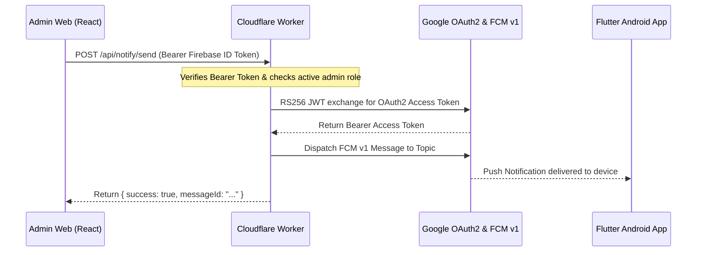

# Cloudflare Worker: Privileged FCM Dispatcher Guide

The `cloudflare_worker/` service is a serverless proxy that dispatches push notifications via Firebase Cloud Messaging (FCM) HTTP v1 API.

It ensures that **privileged Google Cloud Service Account credentials and FCM server keys never leak** into the Flutter application, React admin bundle, or public source code.

---

## 1. Security Architecture



---

## 2. Setting Up Cloudflare Worker Secrets

From the `Notify-Jobs/cloudflare_worker/` directory, use the Wrangler CLI to securely store privileged secrets:

```bash
cd Notify-Jobs/cloudflare_worker
npm install

# 1. Store the Firebase Service Account JSON
npx wrangler secret put FIREBASE_SERVICE_ACCOUNT
# Paste the entire single-line JSON of your Google Service Account key

# 2. (Optional) Store a fallback admin secret
npx wrangler secret put ADMIN_API_SECRET
```

> [!CAUTION]
> Never place `FIREBASE_SERVICE_ACCOUNT` or service account JSON files inside `wrangler.toml`, source code, or GitHub repositories. Always use Wrangler secrets.

---

## 3. Local Development

To test the worker locally:

```bash
cd Notify-Jobs/cloudflare_worker
npm run dev
```

The worker starts a local server on `http://127.0.0.1:8787`.

You can test the health check:
```bash
curl http://127.0.0.1:8787/api/health
```

Expected JSON output:
```json
{
  "status": "ok",
  "service": "notify-jobs-fcm-worker",
  "environment": "production",
  "serviceAccountConfigured": true,
  "timestamp": "2026-09-12T14:30:00.000Z"
}
```

---

## 4. Production Deployment

Deploy the worker to your Cloudflare account with a single command:

```bash
cd Notify-Jobs/cloudflare_worker
npm run deploy
```

Once deployed, copy the generated worker URL (e.g. `https://notify-jobs-fcm-worker.yourname.workers.dev`) and update `VITE_FCM_WORKER_URL` in your Cloudflare Pages Admin dashboard.
